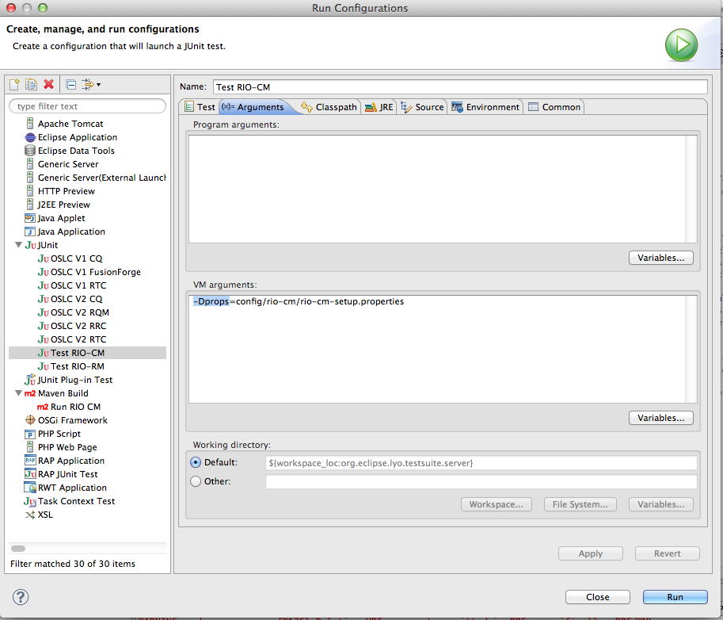

# Eclipse Lyo OSLC Test Suite

- [Introduction](#introduction)
  - [Goals](#goals)
  - [OSLC Specifications Covered](#oslc-specifications-covered)
- [Running the Test Suite](#running-the-test-suite)
  - [Configure the OSLC Test Suites](#configure-the-oslc-test-suites)
  - [Running the Suite](#running-the-suite)
- [Additional information](#additional-information)
  - [Areas for Improvement](#areas-for-improvement)
  - [Building and running the OSLC Test Suites and Reports](#building-and-running-the-oslc-test-suites-and-reports)

## Introduction

### Goals

The goal of the Lyo OSLC Test Suite is to provide a suite of tests which
will test OSLC domain provider implementations against the
specification. A JUnit-based test suite is now available in the project
Git repository. The suite is under development and does not provide full
coverage of the implementations it tests at this time. The goals of the
OSLC Test Suite are to:

-   provide assessment tests for each of the OSLC domains
    -   priority is to cover MUST items first followed by SHOULD and
        then MAY items
    -   provide reporting to show provider implementations an assessment
        report of coverage and successful execution.
-   provide a tool to find bugs in OSLC providers and improve their
    quality

### OSLC Specifications Covered

-   Change Management (V1 and V2)
-   Asset Management (V1 and V2)
-   Quality Management (V2)
-   Requirements Management (V2)
-   Automation Management (V2)
-   Performance Monitoring (V2)

## Running the Test Suite

### Configure the OSLC Test Suites

The test suite **config** directory contains sample configuration files
for different implementations of providers. Currently there are config
files for the Reference Implementation for OSLC (RIO) implementations as
well as some IBM Rational products such as Rational Team Concert and
Rational ClearQuest. We are looking for config files for other
implementations if you would like to contribute one. Just open a
[Bugzilla](http://bugs.eclipse.org) for the Lyo project and attach your
config file.

This example will show configuring to test the Lyo Change Management
(CM) reference implementation.

-   open config/rio-cm/rio-cm-setup.properties
-   typical properties which would need to be configured are the baseUri
    (the URI of the OSLC providers catalog resource) and the
    user/password
-   For the CM RIO provider running on the same system as the test
    suite, the property file is fine.

### Running the Suite

The test suite is run by running an Eclipse JUnit launch for test class
`org.eclipse.lyo.testsuite.server.DynamicSuiteBuilder`.
DynamicSuiteBuilder uses the information in the config file to determine
the version of the tests (OSLC V1 or OSLC V2) and which test classes to
include in the run. The config is passed to the test suite run with the
`-Dprops` argument in the launch. The test suite project contains
several launches already configured to run the suite based on the sample
configuration files. We will run the launch to test the RIO CM provider.

> **Note:** In order to run against RIO CM, you will need to build and
> launch the CM reference implementation following the instructions
> [here](http://wiki.eclipse.org/Lyo/BuildRIO).

| :warning: WARNING                                             |
|:--------------------------------------------------------------|
| These docs have not been updated for https://github.com/oslc-op/refimpl yet  |

1.   Select Run-&gt;Run Configurations and select JUnit
2.   Select the Test RIO-CM launch. Go to the Arguments tab and verify
    the config file location is correct

1.   Click Run
2.   The test suite should run fairly quickly and you will have results
    in the JUnit view of Eclipse similar to this:

1.   Failures will have an exception indicating the root cause of the
    failure.

## Additional information

### Areas for Improvement

-   Increased coverage for currently supported specifications
-   Coverage for OSLC specifications not currently tested
-   Integrated reporting
-   Improved query tests
-   Improved OAuth tests

### Building and running the OSLC Test Suites and Reports

- [Detailed documentation](https://github.com/eclipse/lyo.testsuite/blob/master/org.eclipse.lyo.testsuite.server/assessment/documentation/HowToRunOSLCProviderTestsAndGenerateAssessmentReport.doc) for the OSLC Test Suite and Reports in MS Word format.
    - Overview of the test suites
    - How to run the tests
    - How to create reports