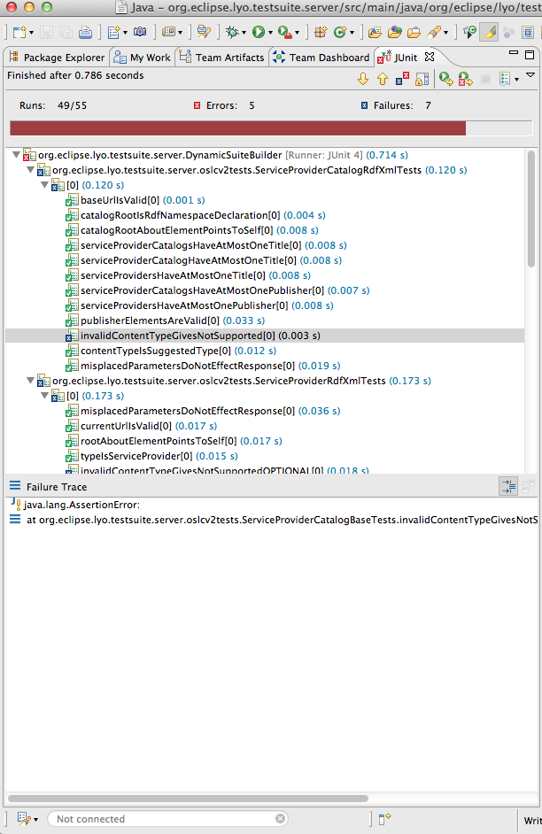

# Eclipse Lyo OSLC Test Suite

- [Introduction](#introduction)
  - [Goals](#goals)
  - [OSLC Specifications Covered](#oslc-specifications-covered)
- [Running the Test Suite](#running-the-test-suite)
  - [Overview](#overview)
  - [Test an RIO server (alternative 1)](#test-an-rio-server-alternative-1)
  - [Test an RTC server (alternative 2)](#test-an-rtc-server-alternative-2)
  - [Test a ClearQuest server (alternative 3)](#test-a-clearquest-server-alternative-3)
  - [Test an RQM server (alt 4)](#test-an-rqm-server-alt-4)
  - [Configure the OSLC Test Suites](#configure-the-oslc-test-suites)
  - [Running the Suite](#running-the-suite)
  - [OSLC Assessment Report (optional)](#oslc-assessment-report-optional)
- [Additional information](#additional-information)
  - [Areas for Improvement](#areas-for-improvement)

## Introduction

### Goals

The OSLC test suite is a set of JUnit tests that made available through the Eclipse Lyo project. It is designed to test against an OSLC service provider (in specific domains, such as CM, QM and RM) for its implementation of the OSLC core specification and the corresponding domain specifications.

The roles of the OSLC test suite include:

**As an OSLC assessment assessor**
In this role, the test suite will run again a particular OSLC provider and as minimal, make sure the provider passes the OSLC core spec test and the OSLC domain spec test. It provides an assessment report delivering clear and actionable information to be eligible for each OSLC spec. Priority is to cover MUST items first followed by SHOULD and then MAY items.   

**As an OSLC quality validator**
In this role, the test suite provides functional capabilities to help test an OSLC based solutions and evolve new or existing OSLC embracing solutions into high quality offerings. It provides reusable test cases to reduce the effort improving the quality of OSLC solution and to find bugs in OSLC providers.

**As an OSLC adoption accelerator**
In this role, the test suite will consider building canned images for learning OSLC, adding inline comments to test cases, and providing additional documentation.

### OSLC Specifications Covered

-   Change Management (V1 and V2)
-   Asset Management (V1 and V2)
-   Quality Management (V2)
-   Requirements Management (V2)
-   Automation Management (V2)
-   Performance Monitoring (V2)

## Running the Test Suite

### Overview

It is recommended that you start with running an OSLC provider test against the reference implementation, with an OSLC domain (CM, QM or RM) that you are interested in.

| :warning: WARNING                                             |
|:--------------------------------------------------------------|
| The test suite was written against the old RIO and hasn't been updated for https://github.com/oslc-op/refimpl yet |

The following sections start on how to run the RIO provider tests, and then cover basic information about running the provider tests against some Rational Products, such as Rational Team Concert (RTC), ClearQuest, Rational Quality Manager (RQM) and Rational Requirements Composer (RRC). 

### Test an RIO server (alternative 1)

| :warning: WARNING                                             |
|:--------------------------------------------------------------|
| These are legacy RIO instructions. OSLC 2020 RefImpl runs via Maven w/o need for configuration. |

1. To start the RIO-CM Server, from “Run” -> “Run Configurations …”, find Maven Build | Run RIO-CM and click “Run”.
1. After the jetty server started, confirm that you can access Rio-CM server via 
http://localhost:8080/rio-cm
1. The very first time you run this on your machine, you will see the setup page. You can enter the defaults for RDF Store Path and Binary Resource Store Path as suggested, and click the “Configure” button. 

**You will use http://localhost:8080/rio-cm in OSLC provider test setting later.**

### Test an RTC server (alternative 2)

1. Prefill some data. E.g. submit a defect type work item called “templatedDefect”.
1. Edit `config/rtc/rtc-setupv2.properties`:
   - `baseUri=https://quagmire.rtp.raleigh.ibm.com:14444/ccm/oslc/workitems/catalog`
   - `formUri=https://quagmire.rtp.raleigh.ibm.com:14444/ccm/authenticated/j_security_check`
   - `userId=admin`
   - `Pw=admin`
1. Use **OSLC V2 RTC.launch** in the next step.

### Test a ClearQuest server (alternative 3)

See [doc/HowToRunOSLCProviderTestsAndGenerateAssessmentReport.pdf](doc/HowToRunOSLCProviderTestsAndGenerateAssessmentReport.pdf), section 4.5 for the details.

### Test an RQM server (alt 4)

See [doc/HowToRunOSLCProviderTestsAndGenerateAssessmentReport.pdf](doc/HowToRunOSLCProviderTestsAndGenerateAssessmentReport.pdf), section 4.6 for the details.

### Configure the OSLC Test Suites

The test suite **config** directory contains sample configuration files
for different implementations of providers. Currently there are config
files for the Reference Implementation for OSLC (RIO) implementations as
well as some IBM Rational products such as Rational Team Concert and
Rational ClearQuest. We are looking for config files for other
implementations if you would like to contribute one. Just open a
[Bugzilla](http://bugs.eclipse.org) for the Lyo project and attach your
config file.

This example will show configuring to test the Lyo Change Management
(CM) reference implementation.

-   open config/rio-cm/rio-cm-setup.properties
-   typical properties which would need to be configured are the baseUri
    (the URI of the OSLC providers catalog resource) and the
    user/password
-   For the CM RIO provider running on the same system as the test
    suite, the property file is fine.

### Running the Suite

The test suite is run by running an Eclipse JUnit launch for test class
`org.eclipse.lyo.testsuite.server.DynamicSuiteBuilder`.
DynamicSuiteBuilder uses the information in the config file to determine
the version of the tests (OSLC V1 or OSLC V2) and which test classes to
include in the run. The config is passed to the test suite run with the
`-Dprops` argument in the launch. The test suite project contains
several launches already configured to run the suite based on the sample
configuration files. We will run the launch to test the RIO CM provider.

> **Note:** In order to run against RIO CM, you will need to build and
> launch the CM reference implementation following the instructions
> [here](http://wiki.eclipse.org/Lyo/BuildRIO).

1.   Select Run-&gt;Run Configurations and select JUnit
2.   Select the Test RIO-CM launch. Go to the Arguments tab and verify
    the config file location is correct

1.   Click Run
2.   The test suite should run fairly quickly and you will have results
    in the JUnit view of Eclipse similar to this:

1.   Failures will have an exception indicating the root cause of the
    failure.

### OSLC Assessment Report (optional)

See [doc/HowToRunOSLCProviderTestsAndGenerateAssessmentReport.pdf](doc/HowToRunOSLCProviderTestsAndGenerateAssessmentReport.pdf), section 6 for the details.

## Additional information

### Areas for Improvement

-   Increased coverage for currently supported specifications
-   Coverage for OSLC specifications not currently tested
-   Integrated reporting
-   Improved query tests
-   Improved OAuth tests