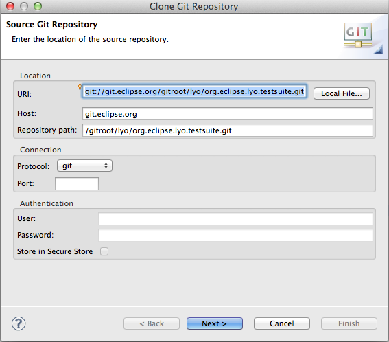
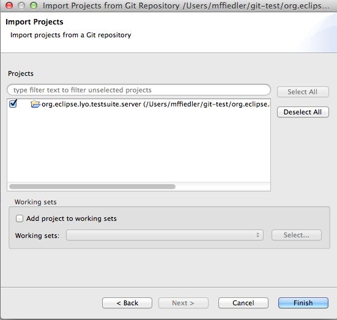
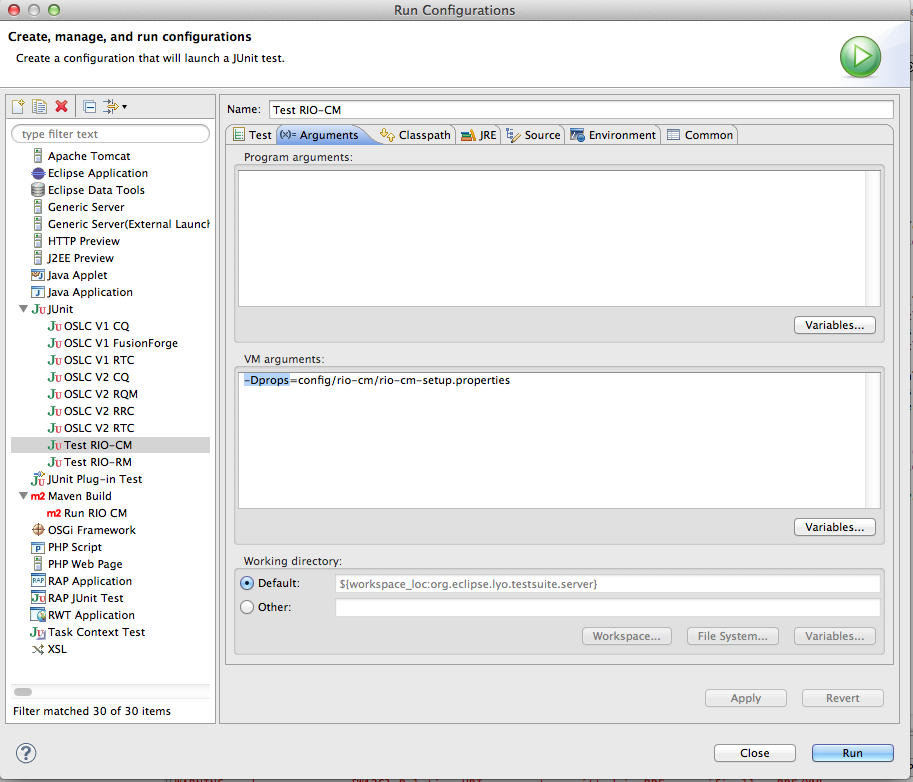
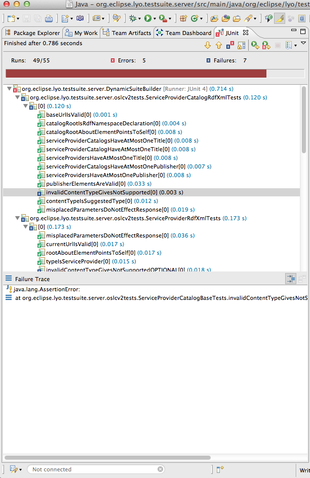

# Building and running the Lyo OSLC Test Suite

## Prerequisites

See [Lyo/prereqs](Lyo/prereqs "wikilink").

## Clone the Lyo OSLC Test Suite git repository

This example assumes EGit is being used

-   Open the Git Repositories view in Eclipse and click the Clone Git
    Repository icon
-   Use
    <git://git.eclipse.org/gitroot/lyo/org.eclipse.lyo.testsuite.git> as
    the URI. User/Password are not required.

-   On the Branch Selection page, select the master branch
-   On the Local Destination page, specify a location or accept the
    default and click Finish

The repository should now show up in your Git Repositories view

## Import Eclipse projects from the git repository

-   In the Git Repositories view, right click org.eclipse.lyo.testsuite
    and select Import Projects
-   Select the Import Existing Projects wizard and click next
-   Select org.eclipse.lyo.testsuite.server

## Configure the OSLC Test Suites

The test suite **config** directory contains sample configuration files
for different implementations of providers. Currently there are config
files for the Reference Implementation for OSLC (RIO) implementations as
well as some IBM Rational products such as Rational Team Concert and
Rational ClearQuest. We are looking for config files for other
implementations if you would like to contribute one. Just open a
[Bugzilla](http://bugs.eclipse.org) for the Lyo project and attach your
config file.

This example will show configuring to test the Lyo Change Management
(CM) reference implementation.

-   open config/rio-cm/rio-cm-setup.properties
-   typical properties which would need to be configured are the baseUri
    (the URI of the OSLC providers catalog resource) and the
    user/password
-   For the CM RIO provider running on the same system as the test
    suite, the property file is fine.

## Running the OSLC Test Suite

The test suite is run by running an Eclipse JUnit launch for test class
**org.eclipse.lyo.testsuite.server.DynamicSuiteBuilder**.
DynamicSuiteBuilder uses the information in the config file to determine
the version of the tests (OSLC V1 or OSLC V2) and which test classes to
include in the run. The config is passed to the test suite run with the
**-Dprops** argument in the launch. The test suite project contains
several launches already configured to run the suite based on the sample
configuration files. We will run the launch to test the RIO CM provider.

> **Note:** In order to run against RIO CM, you will need to build and
> launch the CM reference implementation following the instructions
> [here](http://wiki.eclipse.org/Lyo/BuildRIO).

-   Select Run-&gt;Run Configurations and select JUnit
-   Select the Test RIO-CM launch. Go to the Arguments tab and verify
    the config file location is correct

-   Click Run
-   The test suite should run fairly quickly and you will have results
    in the JUnit view of Eclipse similar to this:

-   Failures will have an exception indicating the root cause of the
    failure.

See [ the test suite description](Lyo/LyoTestSuite "wikilink") for areas
where we are planning improvements.
